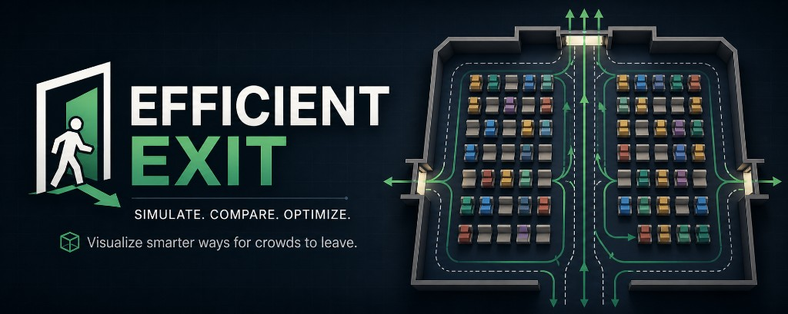

# Efficient Exit



> Simulate. Compare. Optimize. Visualise smarter ways for crowds to leave.

You know that awkward moment at the end of a wedding ceremony where everyone
stands up at exactly the same time, gets stuck in the aisle, and the front
row spends ten minutes trapped behind their second cousin's date who is
slowly putting on a coat? **Efficient Exit** is a tiny lab for that moment.

You pick a strategy — *front-to-back*, *back-to-front*, *outside-in*,
*inside-out*, or *random* — hit play, and watch a top-down 3D scene of
people-shaped boxes thread their way through the aisle. A live stats panel
tracks elapsed time, congestion, and final completion time so you can
actually compare strategies instead of just arguing about them at brunch.

Behind the scenes it's a small simulation engine doing all the boring stuff
that makes the visualisation feel honest: axis-aligned bounding boxes, a
uniform-grid spatial hash for broad-phase collision, in-tick grid commits
for stable queueing, axis-aligned slide-along-obstacle resolution to
prevent perpendicular paths from deadlocking, and lane discipline so the
two halves of every row don't try to merge on the same point of the centre
aisle.

## Tech stack

- **Next.js 16** (App Router) + **React 19** + **TypeScript** (strict mode)
- **Tailwind CSS v4** + **shadcn/ui** components on top of `radix-ui`
- **Three.js** rendered with **@react-three/fiber** and **@react-three/drei**
- **Zustand** for client-side simulation/UI state
- **dnd-kit** for the draggable floating controls panel
- **Bun** as the package manager / runtime

## Prerequisites

- [Bun](https://bun.sh) **1.3+**
- A modern browser with WebGL2 (any current Chrome / Edge / Firefox / Safari)

That's it — there is no backend, no database, and no environment variables
to set up.

## Quick start

```bash
git clone <your-fork-url> efficient-exit
cd efficient-exit
bun install
bun run dev
```

Then open <http://localhost:3000>.

To play with the simulation:

1. Pick an algorithm from the **left sidebar**.
2. Hit **Play** in the top toolbar.
3. **Drag** the canvas to pan and **scroll** to zoom — there's a *Reset
   view* button if you get lost.
4. Open the floating **Controls** panel (top-right by default; drag the
   handle to reposition) to change rows, chairs per side, walking speed,
   collision padding, etc. Layout changes auto-reset the simulation.
5. Watch the **Live stats** panel (bottom-left) for elapsed time,
   congestion count, and the final completion time once everyone has
   exited.

## Scripts

```bash
bun run dev      # Next.js dev server with Turbopack on http://localhost:3000
bun run build    # Production build
bun run start    # Serve the production build
bun run lint     # ESLint (Next.js + TypeScript rules)
bun run smoke    # Headless engine smoke test (see below)
```

## Testing

The simulation engine is intentionally pure TypeScript with no React or
Three.js dependencies, so it can be exercised entirely outside the browser.

### Headless smoke test

`bun run smoke` runs every algorithm against the default room (8 rows × 5
chairs per side = 80 people) in a tight loop and confirms each one reaches
`status === "complete"` with all 80 people exited within a generous time
budget.

Sample output (passing):

```text
PASS | front-to-back  | status=complete | t=  36.83s | exited=80/80 | moved=80 | steps=2210
PASS | back-to-front  | status=complete | t=  36.08s | exited=80/80 | moved=80 | steps=2165
PASS | outside-in     | status=complete | t=  36.83s | exited=80/80 | moved=80 | steps=2210
PASS | inside-out     | status=complete | t=  34.83s | exited=80/80 | moved=80 | steps=2090
PASS | random         | status=complete | t=  35.23s | exited=80/80 | moved=80 | steps=2114
```

The script is `scripts/smoke-engine.ts`. On failure it prints the closest
blocker for each stuck person, which is invaluable when debugging the
collision / pathing systems. Treat this as the canonical regression check
for any change to the engine, models, algorithms, pathing, or collision
modules.

### Static checks

```bash
bunx tsc --noEmit   # TypeScript type-check (strict)
bun run lint        # ESLint with the Next.js + Core Web Vitals rules
bun run build       # Full production build (compiles + type-checks)
```

All three should be clean before merging changes.

### Manual checks in the dev UI

When iterating on visuals, the floating controls panel exposes three
debug toggles that are great smoke tests:

- **Show paths** — draws the polyline waypoint route for every guest.
- **Show collision boxes** — wireframes each person's live AABB; turns
  red when the resolver is currently blocking them.
- **Show exit zone** — highlights the exit threshold so it's obvious when
  someone has cleared it.

## Project layout

```text
app/                                # Next.js App Router entry
  layout.tsx, page.tsx
components/
  app-shell/      AppShell.tsx      # Top-level sidebar + main window layout
  sidebar/        AlgorithmSidebar.tsx
  simulation-window/                # Main window: top controls + canvas chrome
    SimulationWindow.tsx
    TopControls.tsx
  controls/       DraggableControlsPanel.tsx
  stats/          StatsPanel.tsx
  ui/             ...               # shadcn components
features/
  simulation/
    models/                         # Pure data models (no React, no Three.js)
      algorithm.ts, chair.ts, person.ts, room.ts
    algorithms/                     # Release-order strategies
      backToFront.ts, frontToBack.ts, helpers.ts,
      insideOut.ts, outsideIn.ts, random.ts, registry.ts
    collision/                      # Broad + narrow phase collision
      collisionResolver.ts, spatialGrid.ts
    pathing/      waypointPlanner.ts
    engine/       simulationEngine.ts
    stores/                         # Zustand stores (config / sim / UI)
      useConfigStore.ts, useSimulationStore.ts, useUiStore.ts
    components/                     # React Three Fiber scene
      SimulationCanvas.tsx, RoomScene.tsx, SimulationLoop.tsx,
      Floor.tsx, Chairs.tsx, People.tsx,
      ExitZone.tsx, Paths.tsx, CollisionDebug.tsx
lib/
  constants/simulation.ts           # Default geometry + algorithm ids
  math/aabb.ts                      # 2D AABB helpers used by the resolver
  utils.ts                          # cn() helper from shadcn
scripts/
  smoke-engine.ts                   # Headless engine regression check
docs/
  Design Document.md                # Original project brief
```

## How the simulation works

### Pipeline

1. The user picks a config (rows, chairs per side, people count, etc.) and
   an algorithm. `useSimulationStore.build()` constructs a `SimulationWorld`
   plus an `Algorithm` instance from the registry.
2. `<SimulationCanvas>` mounts a single `<Canvas>` containing the room
   scene and a `<SimulationLoop>` whose `useFrame` calls
   `useSimulationStore.tick(dt)` every animation frame.
3. `tick` calls the pure `stepWorld(world, algorithm, dt)` function which
   advances time, releases people via the algorithm's `getNextDepartures`,
   resolves collisions for everyone in motion, and writes a small reactive
   stats snapshot back to the store.
4. People + collision debug visuals are rendered as **single instanced
   meshes** whose per-instance matrices and colours are updated directly
   inside `useFrame` from `useSimulationStore.getState()` — no React
   re-renders per frame.

### Coordinate system

- `+x` runs left/right when viewed from above.
- `+z` runs front-to-back; the back of the room is `+z` and the exit is
  at the smallest `z` value.
- `+y` is up. The camera is an orthographic camera high on the `+y` axis,
  looking straight down.

### Algorithms

Every strategy implements the same `Algorithm` interface
(`features/simulation/models/algorithm.ts`) and pre-computes a release
queue at `initialize`. The engine then releases up to `burstSize` people
every `departureInterval` seconds. Adding a new strategy is a matter of
exporting a new factory and registering it in
`features/simulation/algorithms/registry.ts`.

### Collision and pathing

- 2D axis-aligned bounding boxes in the X/Z plane.
- Broad phase: uniform-grid spatial hash, rebuilt at the start of every
  tick and **incrementally updated after every successful move** so the
  next person processed in the same tick sees the latest layout.
- Narrow phase: strict positive-overlap intersection with a 1 µm epsilon
  so that touching edges don't false-positive as collisions.
- Resolver: tries the full diagonal step first, then x-only, then z-only,
  at full / half / quarter step sizes. This "slide along the obstacle"
  behaviour prevents perpendicular paths from deadlocking on grazing
  contacts.
- Yield rule: if a person is *already* overlapping a blocker, moves are
  still permitted as long as the overlap with that blocker doesn't get
  worse — so the simulation can recover gracefully if numerical drift
  ever puts two bodies inside each other.
- Waypoints follow strict lane discipline: left-side guests stay at
  `x = -aisleWidth / 4`, right-side at `+aisleWidth / 4`, all the way
  through the exit. The two lanes never meet in the middle of the aisle.

## Tuning the simulation

The floating controls panel exposes everything you'd want to tweak in
real time. The defaults live in `lib/constants/simulation.ts` and can be
adjusted as needed:

- `rowCount`, `chairsPerHalfRow`, `chairWidth/Depth/Spacing`, `rowSpacing`
- `aisleWidth`, `exitWidth`, `exitDepth`
- `personWidth`, `personDepth`, `personSpeed`, `collisionPadding`
- `departureInterval`, `burstSize`
- `animationSpeed`

If you change `personSpeed` or `collisionPadding`, you may need to bump
`departureInterval` accordingly. The engine needs the queue spacing
(`personSpeed × departureInterval`) to stay greater than the padded
clearance (`personDepth + 2 × collisionPadding`) for queues to form
without overlap. The default values give 0.66 m of spacing against a
0.55 m clearance, leaving comfortable headroom.

## Roadmap

Things the design doc calls out as future work that would slot cleanly
into the existing architecture:

- More strategies: table/party priority, shortest-path greedy,
  congestion-aware release.
- A* / flow-field pathing to replace the MVP waypoint planner.
- Bottleneck heatmap overlay.
- Side-by-side algorithm comparison mode.
- Save / load simulation configurations.
- Algorithm scoring leaderboard based on completion time, average exit
  time, and peak congestion.

## Acknowledgements

Built from the project brief in `docs/Design Document.md`. The visuals
draw on Tailwind's design tokens and shadcn's component library; the 3D
work is powered by Three.js via React Three Fiber and drei; the
draggable controls panel is built on dnd-kit; the simulation state is
all Zustand.
